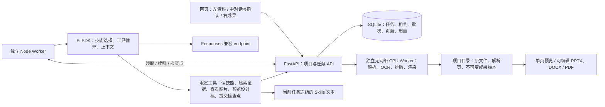
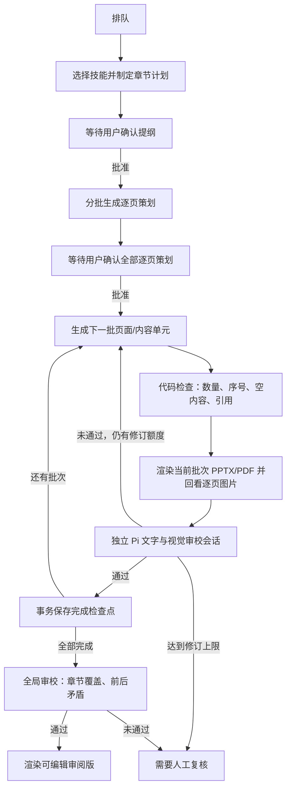

# 图策 ArchFlow：产品需求与界面设计说明

> 状态：第一版评审实现中。本文是产品、UX、PRD 与技术架构的唯一主文档。

## 个人账号、项目权限与完整模型调用记录

页面由一个共享的登录状态入口读取 `GET /api/v1/auth/status`（`enabled` 和 `user`），账号菜单、运行设置和管理页复用该结果。未启用个人账号、未登录或会话过期时，该状态接口返回 `200` 与 `user: null`，不以 `401` 探测登录，避免与外层 Basic Auth 的浏览器挑战冲突；受保护的数据接口仍校验权限。接口响应禁止缓存，登录凭据由现有 HttpOnly 会话 Cookie 管理，不存入 localStorage。部署这一兼容字段扩展时先更新 API，再更新 Web。

这一版采用 **user + project membership**，不增加 tenant 表。用户是身份，项目是共享边界；新项目创建者自动成为 `owner`，数据库成员表同时预留 `member` 角色。以后做“项目负责人邀请另一个用户”时，只需增删成员关系并完善邀请/撤销流程，不搬迁项目资料或更换项目 ID；目前**没有邀请 UI/API**。

```text
外层 Nginx Basic Auth（迁移期保留）
  → 个人注册/登录（共享初始码只用于注册）
  → HttpOnly 服务端会话 + CSRF token
  → API 按 project_members 授权
  → 项目资料 / 对话 / 任务 / 生成成果
                   ↘ 管理员：跨项目排查与完整模型 I/O
```

启用前先备份 `/data`。仅在 API 环境设置随机的、至少 24 字符的 `ARCHFLOW_SIGNUP_CODE`；HTTPS 部署设 `ARCHFLOW_COOKIE_SECURE=true`，本地 HTTP 才用 `false`。代码为空时保留原单用户模式，便于兼容迁移。启用后，先运行 `docker compose --env-file .env.production exec -it api python -m archflow_api.bootstrap_admin`，交互输入**超级管理员的个人账号和密码**；旧项目归管理员，不自动交给首位普通注册者。未建立管理员前，普通用户注册被拒绝。再发放现有网站密码与注册初始码，用户各自创建个人账号。初始码不是管理员密码，也不是用户登录密码；轮换初始码只影响新注册。外层 Basic Auth 暂不移除，确认迁移成功后再单独决定。管理员通过 `/admin` 查看所有用户的项目、正常/回收站对话、消息和模型调用；普通用户默认只看自己的项目。

超级管理员采用数据库中的 `admin` 角色，没有写在代码或环境变量里的万能后门密码。七天的浏览器会话过期后，用同一账号密码重新登录；只要 `/data` 及其备份保留，账号与历史会话记录就保留。忘记密码时，在服务器上重新运行上述交互命令，输入**已有管理员用户名**及新密码；这会保留其身份与项目权限、撤销旧登录会话。不要把管理员密码或交互命令的输入写进日志、工单或聊天。将来若要做彻底删除、保留期或合规擦除，须另行定义；“永远可见”不能承诺覆盖已被物理删除或丢失且无备份的数据。

密码使用随机盐 scrypt；会话 token 仅存哈希，7 天过期；Cookie 在 HTTPS 下启用 `Secure`、`HttpOnly`、`SameSite=Lax`，变更请求需会话 CSRF token。登录/注册按用户名限制尝试次数。API 从会话推导项目权限，不信任客户端给出的项目、对话、任务或文件 ID；越权查询返回 404。Worker 使用独立 bearer secret。全局运行额度仅管理员可更改；所有已登录用户仍可按原产品设计发起技能 Draft PR。技能/案例库是共享资源，项目资料、对话、任务及成果是项目资源。

从启用该实现后的**每次物理模型调用**都会先预占 call ID，再持久化实际发往模型的 JSON 请求，随后持久化完整返回消息与流事件，或错误及已收到的部分事件。已知 endpoint/API key 字符串会从记录中替换掉；用户需求、资料与模型输出按“全文记录”保留。API 将压缩快照原子写入 `/data/projects/<project-id>/workspace/model-calls/<job-id>/<call-id>/`；普通诊断 JSON 下载不含这些记录，仅管理员可经 `GET /api/v1/jobs/<job-id>/model-calls` 及其 call-ID 子路径读取。写入失败会停止当前步骤，不假装审计完整；断连可能留下有请求而无响应的记录，重试使用新 call ID。旧调用无法补录。

日志沿用项目已有的目录 ID，兼容旧项目的名称 ID 和新项目的 UUID；仅任务 ID 与调用 ID 强制为 UUID。路径必须留在本项目目录，禁止目录穿越和跨目录符号链接，无需迁移或重命名已有项目。

任务的 JSON 诊断下载同时包含 `job`、已保存的 `units`、`workflow_events`、`diagnostics` 与 `model_calls`。`diagnostics` 按时间记录每次步骤开始/结束、物理模型调用开始/结束、重试原因及等待时间；包含阶段、页段、尝试次数、call ID、模型、耗时、HTTP 状态和上游请求 ID（若上游提供）。错误在普通下载中只保留不含原文的分类标签；用 call ID 可在管理员界面关联对应的完整请求、返回及部分流事件。完整模型记录仍可能包含项目机密，绝不放入普通下载。管理员可通过 `GET /api/v1/jobs/<job-id>/debug-download` 下载汇总 JSON（包括进行中的任务）：`model_io` 逐次包含完整输入、输出和 `complete` / `partial` / `missing` 记录状态；该文件只能受控保存与传输。诊断写入是尽力而为，完整模型请求/响应快照仍是严格写入：断电、租约丢失或 API 不可用时，可能只有预占 call ID、没有终态；不要把这种记录解释为模型实际完成。已存在的旧任务不会补出历史诊断。

完整记录与项目目录一起进入现有备份，可能显著增加磁盘/备份用量。新项目与新上传目录设为仅服务进程可访问；旧目录权限需在部署迁移时核查。目前**不会自动删除**，也没有应用层静态加密；服务器 `/data`、备份及管理员账号必须严格限制访问。删除对话只是移入回收站，不清除其成果/模型记录；登录页明确告知管理员可排查私有内容。公开发布前还需确定保留/彻底删除策略、管理员读取审计、账号找回、邀请与撤销、备份恢复和负载测试。现在的 SQLite + 文件布局针对已确认的小团队并发，不宣称已通过公开规模验收；若将来需要组织级计费/策略，可再引入组织层，不应为目前没有的需求先加 tenant。

## 当前实现：项目资料驱动的文档工作流

左侧对话确认卡与右侧成果导航使用同一任务阶段：整理资料与提纲 → 确认提纲 → 逐页/逐章策划 → 生成与审校 → 排版与下载。右侧默认定位当前任务阶段，即使该阶段首批内容尚未保存，也显示等待状态而不是误把上一阶段高亮为当前阶段；用户主动回看旧阶段时，明确标注任务实际阶段与正在查看的阶段。成果预览选择只影响阅读，不改变任务进度或对话记录。





### 职责与边界

- Pi 负责模型交互、按描述选择 Skill、读取参考资源、调用应用工具。复用 Pi，不另建通用代理框架。
- FastAPI 负责验证请求、项目/对话归属、幂等创建、批次事务保存、分页读取、取消与用量记录。
- Worker 负责领取任务、续租、限制调用/时间/修订次数、推进批次与恢复。模型输出的完成声明不等于任务完成。
- SQLite 是单机原型的任务真值；通过原子租约防止两个 Worker 同时提交同一任务。多服务器部署再迁移到 PostgreSQL/任务引擎。
- Skills 的名称与描述按需展示；读取完整 `SKILL.md` 后再使用。每次任务冻结技能文本、JSON 风格 token、校验脚本源码与参考图集，并记录哈希；图集内容按哈希去重存储，Agent 只能通过受限工具查看，不能执行脚本或读取任意路径。运行中编辑技能不会改变已启动任务的规则与风格依据。
- 模型没有 shell、联网、任意路径读写或执行上传脚本的权限。Skill 文本和必读参考被任务冻结；任意技能脚本不自动执行。部署使用可独立安装的 PptxGenJS、python-docx、LibreOffice、Poppler、Tesseract，不依赖 Codex 本地专有运行库。
- 资料上传一次，所有项目内对话共享。显示等待解析、正在解析、已解析、失败；失败可重试或排除。PDF 提取文字和分页图，扫描页 OCR；Office 转换分页；图片保留比例。单文件上限 50 MB、500 页，Office 解压体积上限 300 MB。解析 Worker 非 root、无网络、受内存限制，不能视为完整的恶意文档沙箱。
- 文件角色为当前项目资料、参考案例/风格、项目图片、暂不使用。参考项目指标不能当成当前项目事实。每个任务固定资料、角色、技能与需求快照；运行时新增资料不悄悄改变正在生成的版本。图片按 catalog ID 读取、证据引用按文件/页 ID 验证。
- 模型与数据库继续使用冻结的文件/页 ID 校验来源；右侧提纲、策划、正文、批注和新导出的文件将已匹配的编号显示为“《原文件名》第 N 页”（连续或多页合并显示）。文件名取当前成果版本冻结的资料快照，不依赖之后的文件列表变化。用户选择显示后的文字添加批注仍须通过原文与版本哈希校验；来源索引读取失败时明确提示，不臆造文件名。
- PPT 内容单元对应实际一页；投标单元对应章节/内容块，不等于 Word 物理页。页面数由实际 PDF 渲染结果确定。
- 逐页/逐章策划是内部制作说明。方案逐页策划必须分别保存拟展示标题、简短的观众可见文案、具体图表/画面方案、这一页的目的与证据；旧策划无这些新字段时仍可读取。正文是甲方或评审实际阅读的页面文案/章节文字。标题可以相同，但正文不得复制策划说明或把“页面目的”“建议采用”等写作指令排进文件。保存正文时拦截与对应策划逐字相同的内容，独立审校还要判断是否仅轻微改写、是否真正成为对外文字。旧版本不因规则升级而静默重写，需要审阅并生成修订版。
- 方案正文批次由模型 API 输出 13.333 × 7.5 英寸画布上的可编辑元素：文本、来源图片、表格、矩形、椭圆和线条；旧版四布局数据仍可读取，但新任务不再受其限制。确定性排版代码将这些元素写成 PPTX，再由 LibreOffice 从同一 PPTX 转出 PDF，并由 PDF 渲染逐页预览图；PDF 不由模型另写一份。每批须回看真实页面图片，按问题修改后再保存；独立审校会话也看真实页面。渲染器只验证与转换，不替模型决定版式。PPT 来源放在备注中。密度、画布边界和页数异常阻断提交/导出，不自动缩小字体。以 PPTX 为编辑与视觉验收主产物，边生成边按批排版；不先用 HTML 定稿再转换成 PPTX，以免网页效果与可编辑 PPTX 不一致。参考 PPT 当前只读取页面/原图和主题色，不保证逐像素复刻；没有自动效果图生成、设计工程计算或人工级视觉质量保证。
- 产物始终是可编辑审阅版。文字审校通过和渲染成功，不代表专业规范核验、内容合法承诺或甲方视觉质量验收已完成。
- 运行需显式配置 endpoint 和密钥；未配置时网页禁用启动。测试用本地模拟供应商不冒充真实模型质量验证。

### 长文档与恢复

每个任务先生成紧凑的章节范围计划，用户确认后分批生成逐页/逐章策划，再次确认后按 1–10 个内容单元生成并审校。每个检查点使用独立、内存中的 Pi 会话；开启预算内记忆整理，关闭隐式供应商重试与缓存保温，所有模型调用统一预占、计量。Worker 只对连接中断、超时、限流及临时 5xx 等模型服务故障自动重试当前检查点：最多额外 4 次，指数退避并加入抖动；认证、配额、上下文及工作流错误不重试。重试前重新读取当前租约下的持久化摘要与任务状态；若检查点已提交但响应丢失，不再重复生成。一次尝试若已消耗超过 8 次调用或 32,000 tokens，且没有更新的可用恢复摘要，就暂停自动重跑，避免反复支付同一段工作。每次物理请求仍须重新预占调用额度。每轮只携带计划、事实、当前批次及简短进度，不重传数百页全文。批次草稿和审校均事务提交；重启后先审校已保存草稿，再继续未完成批次。`completed_units` 只统计已通过审校的单元；已保存但待审校的草稿仍可恢复。模型调用与数据库提交之间不能保证 exactly-once；中断可能重复尚未保存的调用，但不会重复插入成果。

最终全局审校读取计划、所有批次已通过的审校摘要，并按需读取跨章节边界的原文；它不是把全部原文重新装进一次请求。发现问题时保留全部草稿并进入人工复核。调用前持久化预占次数，回复后、工具执行前记录 token 用量；所有 Pi 压缩请求走同一个预算与用量边界。实际美元成本取决于 endpoint 的价格；token 是软预算，最后一次在途调用可能超过预算，崩溃或取消时供应商未返回的用量无法准确计入。

上下文默认 `ARCHFLOW_LLM_CONTEXT_WINDOW=auto`：根据生成或审校的模型 ID 分别解析官方上限及日期快照。默认生成与审校模型为 `gpt-6-astra`，均使用 high reasoning。已核实 `gpt-6-astra`、`gpt-6-sol`、`gpt-5.5` / `gpt-5.4` 为 1,050,000，GPT-5/5.1/5.2、5 mini/nano、5.4 mini/nano 和 5.3 Codex 为 400,000；GPT-4.1 系列为 1,047,576，GPT-4o 系列为 128,000。配置数字用于覆盖已知 gateway 的较小限额，但不超过官方模型上限；未知别名必须显式配置，不能猜测。默认每次输出 8,192，并限制在该模型官方输出上限以内。参数来源：官方 `https://developers.openai.com/api/docs/models/<model-id>`，`gpt-6-astra` 核实日期 2026-09-30。扩大上下文不修改用户批准的累计预算，也不代表当前私有 gateway 已验证支持官方全部容量。

Pi 自动整理旧工具结果与对话记忆，保留最近内容和来源证据；压缩阈值取模型窗口 65% 与 32,000 的较小者，以减少重复传入资料的成本。它与任务累计额度独立：提高额度不能延迟记忆整理。这是记忆整理时机，不是降低模型硬上限。不可压缩的最新大块输入或 gateway 限制仍可能导致暂停；单次上下文错误不应建议增加累计额度。完整确认需求、页数与当前批次始终固定在运行上下文中，不能被摘要替换。压缩后的摘要按当前阶段/批次保存到 SQLite，重启及同租约重试可恢复；摘要不是新的事实或批准。同一会话压缩前已读取并验证的冻结技能规则保持有效；新会话仍须重新读取技能。每检查点最多 60 次调用、8 次压缩、15 分钟；SDK 对真实溢出最多压缩重试一次，任务额度到达上限停留在已保存进度。供应商会话亲和性关闭，避免兼容 gateway 的 HTTP 520；不依赖 gateway 支持专用 `/responses/compact`。

对话只显示实际步骤：整理资料与提纲 → 确认提纲 → 逐页/逐章策划 → 生成与审校 → 排版与下载。过程提示来自 Worker 真实执行状态，不伪造进度百分比；JSON、调用次数及 token 明细收进默认折叠的“技术诊断与用量”。策划阶段暂停显示“章节提纲已完成；逐页/逐章策划已暂停”，若没有保存策划则显示“尚未保存”，不以 0 页掩盖已有提纲。审校未通过不能把“生成与审校”标为完成。确认卡作为历史需求保留，右侧版本选择独立于对话。旧失败任务不自动启动，也不擅自提高额度；历史的 10 页版本不会因为新输入要求 40 页而被静默改写。

运行中的任务在真实步骤文字旁显示轻量 SVG 旋转图标，如“正在应用设计技能”“正在阅读项目资料”。只在 `running` 且范围有效时动画，排队、待确认、失败、取消及完成均静态；不以轮播文案模拟工作。状态文字供屏幕阅读器播报，图标不重复播报；`prefers-reduced-motion` 关闭旋转但保留文字。

### 需求数量与运行设置的一致性

- `/api/v1/requirements/resolve` 是中文/英文显式数字数量解析的唯一实现，无模型费用。聊天补充和确认卡文本编辑均通过此接口同步数量；同步完成前不显示旧数量，不允许提交。页面/章节引用与否定数量不作为总量，后续要求优先。尚不能把任意自然语言理解当作模型澄清；用户始终可以手动确认数量。
- 页数、章节数与顶部运行额度的表单草稿保留为文本，允许清空和重新输入，不把空值立即变成 0；失焦整理前导零，仅有效范围内的整数可转换为提交数值，空值和越界值不能创建任务或保存设置。
- 结构化 `target_units` 是执行范围的唯一依据。手动数量覆盖文本中的数字时明确提示，并保存 `count_override`；旧确认数量不因后续配色等非数量修改被重置。创建接口拒绝未经确认的数量冲突。
- 新提纲必须声明同一个 `target_units`；其 `sections` 可以把多页分组，但所有范围需从 1 到目标数量连续覆盖且不重叠。方案设计目标是实际 PPT 页，投标目标是内容章节，不把 Word 物理页混为一谈。模型工具、后台批次、右侧范围和导出使用同一份结构化范围。
- 旧记录在读取时进行兼容适配，不重写原提纲或用量。若原文字要求与确认数量冲突，显示需要重新确认；审批、续跑、局部修订和 Worker 领取均阻止执行此范围。用户通过确认卡保存正确范围的新版本，旧成果保留。
- 顶部齿轮管理共享工作空间的运行保护参数，保存在 SQLite 的 `runtime_settings`，默认每任务 **100,000,000 累计 tokens / 20,000 次调用**；可配置范围为 1,000–1,000,000,000 tokens、1–100,000 次调用。极高默认值是当前内部测试需求，不代表成本估算或保证任务完成。共享密码下所有成员均可修改；公开多租户前必须增加管理员权限、租户配额和独立费用治理。
- 需求卡不再展示 token 编辑器。新建完整版本、局部修订统一捕获顶部设置；设置保存本身不启动、不恢复、不修改历史任务。旧任务触及额度后由用户点击“按顶部运行设置继续”，使用设置与已有额度的较高者，不降低原额度，不清零历史用量。取消、检查点、异常循环与超时保护仍有效。
- 额度只是任务安全阀，不是模型的单次窗口，不是美元预算。生成、审校、压缩都计入同一任务累计量；最后一次在途请求可能超过 token 软上限。提高额度不应替代范围一致性校验、材料按需读取、上下文整理或失败诊断。

网页草稿每组取 5 个单元，渲染成果只加载当前一页图片，不把数百页同时塞进 DOM。当前一台服务器、一个串行模型 Worker、一个串行 CPU Worker；20 人在线不等于 20 个模型/Office 任务并行，也尚无 20 人负载验收。可增加模型 Worker；CPU Worker 当前保持单实例。多服务器部署需迁移 PostgreSQL、对象存储和工作流引擎（仍 TBD）。共享密码下成员共享项目，不是公开多租户平台。

### UX 与修改

#### 统一审阅反馈

- 提纲、逐页/逐章策划、正文修订使用同一个审阅组件。“批准 / 修改意见 / 取消任务”在同一排；按钮文字简短，下一阶段由进度说明与提示补充。当前任务进入待确认阶段、需要人工复核或完成正文时，意见框默认展开；同一阶段轮询不覆盖用户主动收起的选择。历史版本的空编辑器收起，未提交草稿和批注保留；展开本身不调用模型。

- 每个已确认版本的确认卡提供“审阅反馈”：整体意见与右侧所有待提交的定向批注一起发送，只有一个“提交反馈，生成修订稿”入口。右侧“加入本次反馈”只持久保存批注，不调用模型、不批准流程。整体意见的未提交草稿暂存在当前浏览器，显式提交后与批注一起冻结到服务器；批注本身在服务器保存，刷新不丢失。
- 批注绑定原任务 ID、阶段、章节/页面位置、引用文字及内容哈希。引用须属于保存过的原文；跨段、跨版本或过期内容不能误绑定。选择版本只读，未保存的选文批注编辑期间禁止切换版本；已保存批注在对应确认卡汇总，可以移除尚未提交的批注。已提交反馈不可删除，是修订历史。
- 同一版本可以一次提交提纲、策划、正文的意见，后台从最早涉及阶段修订；每条意见仍按原阶段与位置传给 Agent，不混入项目事实或改变已确认页数。整体意见允许调整该阶段的全部内容，只有定向批注时保留未涉及的提纲段落/页面。调整交付数量仍需确认新需求，而不是通过批注偷偷扩大授权范围。
- 提纲修订等待提纲确认，策划修订等待策划确认，正文修订经审校后进入 `waiting_review`，人工确认才排版。继续反馈创建新的不可变版本，原成果保持可查看；不要求取消旧稿再从聊天重走一遍。工作中的任务可记录批注，但提交修订需等任务结束或暂停，避免两个修订同时写同一对话。
- 右侧按“2 提纲 → 3 逐页/逐章策划 → 4 生成与审校 → 5 排版与下载”展示可切换步骤，与对话卡片编号一致；切换到页面预览后仍可返回完整策划。未产生的阶段不可点击，正文批次一经保存即可预览，不必等文字审校完成。页面预览在排版成功后开放。图片预览不是可选择文字的 DOM，文字批注针对已保存的正文而不是截图坐标。长文稿仍按 5 单元分页加载，最多 100 条批注一次提交。审校失败的长诊断默认折叠；主界面只说明未通过、已完成数量和下一步操作，不把模型原始审校文字或内部文件编号当成用户指令。阶段、锚点校验、审批和 Agent 反馈注入对方案、投标等模块复用，不依赖项目名称或错误样例。

- 生产启动不插入测试项目，不依赖固定项目名称或 ID；空资料库先由用户创建项目，既有项目与历史数据保持不变。Worker、资料索引、检查点、审批与版本预览使用同一套模块/状态规则；测试供应商和固定样例只位于测试目录。
- 故障通过服务端 `failure_kind`（预算、上下文、模型配置、模型服务、工作流）传递，前端不搜索原始错误文案决定处理方式。旧记录没有类别时提供通用重试，不伪造原因；上下文整理仍失败时如实提示配置/输入问题，不承诺一次重试必然解决。
- 左侧资料区可收起、可调宽；上传入口在文件列表上方。对话内没有无效回形针。
- 中间是唯一需求输入入口。发送有真实状态，服务器立即持久保存接收提示，首条需求截取 24 字作为标题，可手动重命名。即时提示是确定性的流程反馈，不声称进行了模型分析。
- 对话标签带删除按钮与居中确认弹窗。删除当前标签后切换相邻对话，删除最后一个后回到可直接发送的空状态。服务端软删除持久化；项目资料、聊天与历史成果不清除，未完成任务在同一事务中取消并撤销 Worker 租约，禁止针对已删除对话新建生成任务。数据库 v1→v2 自动增加 `deleted_at`，升级前保留备份。
- 中间的待确认卡自动带入聊天需求和上一版已确认摘要；摘要默认展开、宽度随卡片固定，允许拖动调整高度。中英文页数/章节数提议来自最新需求，页码/章号引用不误当总长度；投标文件的页数不直接当作章节数。超出 500 单元或 20,000 字摘要时明确提示，不静默缩减数量或丢弃已确认需求。数量和明确 token 上限仍需人工确认，不是发送消息即偷偷开始付费生成。先批准提纲，再批准页面/章节策划及全量生成范围。
- 确认成功后，卡片转为带 V1/V2 标记的只读历史记录，按服务器创建时间插入对话，不会因任务开始、取消或刷新而消失。每版需求使用服务器任务记录，保留人工编辑摘要与运行总上限；完整历史不受项目概览 30 条上限影响。收到补充要求后隐藏旧提纲的批准入口，提示确认新版本，不能把补充消息当作授权。
- 右侧默认收起，有提纲时展开，只展示成果版本、提纲、草稿/真实页面预览、排版状态和下载，不再重复要求填写目标。版本选择器固定在右侧顶部，独立于当前工作流；切换只读预览不改变中间消息、需求卡或当前任务，不触发付费调用。创建第二版时保持第一版预览；用户主动切换，浏览器记住该对话的预览选择。各历史需求卡可直接打开对应成果。
- 确认前补充条件，可取消旧提纲任务并重新整理；运行中补充仅记录，不改动已授权快照。完成后按指定页码创建新版本，同一批次内不在授权范围的页面也必须原样保留；旧版本不可变。
- 失败显示实际错误，重试保留检查点；达到调用/token 上限停下，用户可明确提高总上限继续，禁止无限重试。JSON 仅保留在诊断入口。
- 仅全量完成目标页数并进入完成/人工复核时才冻结 Office 导出；40 页任务不能把先生成的 10 页伪装成完整 PPT。失败/取消任务保留 JSON 诊断草稿，避免续跑后的新内容与旧导出不一致。

### 配置与测试

1. 安装 Python API 与 pnpm 工作区依赖（见 README），使用 `services/api/.venv/bin/python services/api/scripts/generate_job_contracts.py` 生成前后端 wire contract。
2. 在未提交的 `.env.production` 中设置 `ARCHFLOW_AGENT_ENABLED=true`、`ARCHFLOW_WORKER_TOKEN`（随机服务间密钥）、`ARCHFLOW_LLM_BASE_URL`（含 `/v1` 的基础地址，Pi 添加 `/responses`）、`ARCHFLOW_LLM_API_KEY`、生成与审校模型。不要把 Codex 的 ini 配置直接放入浏览器；这里是独立服务。
3. `docker compose --env-file .env.production up -d --build`；本地预览明确使用 `.env.agent-preview`。网页左侧上传、等待解析；中间描述要求、确认摘要与单元数，再确认提纲/逐页策划；右侧查看和导出。没有第二套目标表单。
4. API 测试：`services/api/.venv/bin/pytest services/api/tests -q`；Pi 测试：`pnpm --filter @archflow/agent test`。本地 SSE 供应商验证 Pi 的方案批次渲染工具循环、审校/修订，以及真实 FastAPI / SQLite 的 137 单元投标流程；API 另覆盖 1–500 单元（含 100 页方案）、完整导出门禁和视觉预览租约。隔离 documents 容器的 PPTX→PDF→图片冒烟测试验证真实排版；这些均不消耗模型额度，也不等于真实模型的设计质量验收。
5. 前端规则测试：`pnpm --filter @archflow/web test`。运行隔离预览后，使用已安装 Playwright 的 Node 分别运行 `apps/web/tests/workflow-browser.mjs` 和 `apps/web/tests/project-browser.mjs`；可用 `ARCHFLOW_PLAYWRIGHT_MODULE` 指向现有模块，`ARCHFLOW_TEST_URL/USER/PASSWORD` 指定测试服务。所有 API 被模拟，不写入用户资料、不调用模型；覆盖空项目、失效项目选择、卡片顺序/持久化、不同数量、已编辑需求继承、独立版本选择、旧预览保留与可调整高度的编辑器。已有真实任务运行时不为测试重启 API / Worker。

上传临时文件使用受保护的 `/data/tmp` 磁盘目录，Nginx API 关闭请求缓冲，避免 23.5 MB 文件耗尽 16 MB tmpfs。备份覆盖 SQLite 和 `/data` 项目原文件、索引、版本；应定期验证恢复，不仅检查压缩包存在。

Nginx 使用 Docker 内部 DNS 动态解析 web/api 容器，避免更新容器 IP 后持续 502。配置依赖 Compose 中的 Nginx 1.28；共享内存 upstream 与 `resolve` 的配置见 [官方说明](https://nginx.org/en/docs/http/ngx_http_upstream_module.html#resolve)。

离线长文档测试：在 documents 镜像内运行 `services/api/scripts/document_smoke.py /test-output --pages 100 --chapters 100`，合成验收输出 100 页 PPTX 和 121 页 DOCX。真实模型冒烟脚本 `services/api/scripts/agent_smoke.py` 需显式 `--run-paid-test` 和网站测试密码；创建独立虚构项目，最多 70 次调用/25 万累计 tokens，不读取用户项目，不自动批准用户任务。离线性能测试不代表 100 页真实设计质量验收。

### 验收原型

验证 Skill 选择和读取、工具循环、多批次生成、审校失败后修订、租约失效恢复、幂等创建、取消、项目隔离、分页和资源上限。真实 endpoint 的模型质量验证需要另行配置密钥并运行小样本；不把离线测试通过当作几百页成果质量保证。

参考：[Pi SDK](https://github.com/earendil-works/pi/blob/main/packages/coding-agent/docs/sdk.md)、[Skills](https://github.com/earendil-works/pi/blob/main/packages/coding-agent/docs/skills.md)、[自定义 provider](https://github.com/earendil-works/pi/blob/main/packages/coding-agent/docs/custom-provider.md)。

## 1. 产品定位

图策 ArchFlow 是面向建筑与室内设计团队的智能工作平台。它不只是回答问题的 Copilot，而是能够读取项目资料、理解工作目标、组织执行步骤、调用专业方法与模型，并持续产出设计成果的智能系统。

产品在界面上不需要反复强调“智能体”概念。用户看到的是清晰的业务模块、项目资料、执行过程和最终成果。

核心原则：

- 对话是控制与协作入口，不是产品的全部。
- 中央工作区用于展示当前任务、过程和成果。
- 推荐流程帮助新用户快速开始，但不限制有经验用户的操作方式。
- 用户可以随时通过聊天补充条件、跳过步骤、退回修改或要求系统改变执行顺序。
- AI 生成的专业成果需要由设计师或相应专业工程师复核。

## 2. 品牌命名

- 中文名：图策
- 英文名：ArchFlow
- 推荐组合：图策 ArchFlow
- 产品描述：建筑设计智能工作台
- 英文描述：Intelligent Workspace for Architecture

不再使用：

- 筑智
- ArchPilot
- AI Copilot

## 3. Logo 方向

Logo 参考用户提供的两张图片，但不逐像素复制，形成独立的品牌图形。

### 图形标志

- 使用模块化、几何化的建筑体块语言。
- 参考六边形、空间模块或多个体块组合形成的抽象图形。
- 图形需要同时让人联想到建筑体量、空间组合、流程连接和多专业协作。
- 主色使用深海军蓝。
- 辅色使用低饱和的浅青绿色。
- 保持平面、简洁，避免复杂渐变和具象建筑轮廓。
- 在 16px、32px 的网站图标尺寸下仍能辨认。

### 中英文组合

应用内顶部导航推荐使用紧凑横向组合：

```text
[几何图标]  图策 ArchFlow
```

中文“图策”与英文“ArchFlow”都需要清晰出现。ArchFlow 使用简洁、现代、略带几何感的无衬线字体。

推荐比例：

- 图标在顶部导航中的显示尺寸为 32–36px。
- 中文“图策”约 16–17px，字重较高。
- 英文“ArchFlow”约 18–20px，字重中等。
- 图标与文字间距约为图标宽度的 25%。
- 中文和英文处于同一行，中文在前，避免上下堆叠占用导航高度。
- 应用内顶部不显示英文副标题，以保持精炼。

在登录页、项目空状态或品牌介绍页面，可以使用完整组合：

```text
[几何图标]  图策 ArchFlow
            Intelligent Workspace for Architecture
```

Logo 图形建议由 5–6 个独立几何模块围绕中心组合，形成建筑体块、平面组织和流程汇聚的视觉印象。深海军蓝为主体，浅青色模块约占 25%–35%。

## 4. 信息架构

顶部保留三个主要业务模块，不在模块名称中强调“智能体”：

1. 方案设计
2. 投标文件
3. 施工图协同

案例与技能库作为辅助入口，不作为第四个主要业务模块。三个主业务名称使用更高字重和独立的激活下划线，确保与项目选择、案例/技能库等辅助操作有明显层级差异。

“案例 / 技能库”内部只按内容类型拆成两个标签：

- 技能：按代码库真实文件夹层级展示完整技能内容，可进入编辑器修改并创建 GitHub Draft PR。
- 案例：第一版只提供文件上传入口，不再按方案、投标等功能分类。

Markdown 是主要人工审阅内容；JSON、YAML、Python、脚本及其他代码/二进制文件仍可访问，但在目录中统一使用闭眼图标弱化，提示其不是主要人工审阅对象。

技能评审页采用“当前技能内容 + 右侧技能选择器”，不把所有技能连续纵向展开。右侧用较大的选择项展示技能级别信息；点击技能后，左侧原位切换并展开该技能的完整文件目录。窄屏下选择器移到内容上方，保持一次只查看一个技能。

## 5. 第一版范围

第一版完成两个主要页面：

1. 方案设计
2. 投标文件

施工图协同保留导航入口和简要说明，暂不完成主要功能。

第一版允许上传：

- JPG、PNG、WebP 等图片
- PDF
- Word
- Excel
- PowerPoint

第一版暂不支持：

- CAD/DWG
- DXF
- SketchUp 文件
- PKPM 模型或计算文件

## 6. 项目与工作区

“冷链产业园”是当前已选择的项目名称，不显示“示例项目”或“界面评审版”等内部说明。

项目选择器位于顶部导航右侧，与三个主业务入口分开。点击后显示已有项目，并提供“新建项目”。创建成功后自动切换到新项目。

第一版的新项目使用轻量文件系统适配器：服务端生成不可猜测的项目 ID，以此创建独立目录，不使用用户输入的项目名作为路径。每个项目预建：

```text
.local/projects/{project_id}/
├─ metadata.json
├─ uploads/
└─ workspace/
```

这使团队可以立即评审项目切换流程；正式公开部署时，项目元数据迁移到 PostgreSQL，文件迁移到 S3 兼容对象存储，页面交互和 API 契约保持稳定。

## 7. 方案设计页面

### 推荐流程

1. 创建或选择项目
2. 上传设计任务书、用地指标、基础图纸和参考图片
3. 系统读取资料并提取项目条件
4. 用户确认或修正项目条件
5. 系统生成 PPT 提纲
6. 用户调整章节、顺序和重点
7. 系统生成完整 PPT
8. 用户通过聊天修改内容
9. 预览并下载 PPT、PDF 或图片成果

### 灵活操作

推荐流程不是强制向导。用户可以随时通过聊天直接提出目标，例如：

- “先不要分析案例，直接整理场地分析。”
- “把设计构思提前到第二章。”
- “只生成汇报提纲，暂时不要做完整 PPT。”
- “根据我刚上传的图片重做封面。”
- “回到项目条件，把建筑面积改成 12 万平方米。”

系统应根据对话更新当前计划，并在影响已有成果时提示用户确认。

### 状态设计

只有在 PPT 已经生成后，才显示大页面预览、版本选择和底部页面缩略图。首次进入时应显示上传资料和项目条件整理界面。

## 8. 投标文件页面

### 推荐流程

1. 上传招标文件、评分办法、公司资料和历史案例
2. 检测可能的敏感信息
3. 用户确认脱敏范围
4. 拆解资格条件、技术要求、评分点和交付时间
5. 生成招标要求响应矩阵
6. 选择或自动推荐投标技能与历史案例
7. 生成质量、工期、造价和重难点等章节
8. 用户通过聊天修改周期、结构和写作重点
9. 检查缺失材料、未响应条款和前后矛盾
10. 下载 Word 或 PDF 成果

用户同样可以跳过推荐步骤，通过聊天直接指定任务。

## 9. 页面布局

桌面端由三个主要区域组成：

- 左侧：项目资料与文件
- 中间：人与 ArchFlow 的对话、执行步骤和会话标签
- 右侧：当前成果、PPT 页面或文档预览

采用已确认的 A 布局。三个区域都支持拖动分隔线调整宽度：

- 左侧资料区可以收起、展开和调整宽度。
- 右侧成果预览区可以收起、展开和调整宽度。
- 中央聊天区始终保留，随两侧面板自动扩大或缩小。
- 用户通过拖动分隔线改变面板宽度。
- 页面可以记住用户上一次设置的宽度。
- 小屏幕下改用抽屉或上下布局。

## 10. 对话体验

- AI/ArchFlow 消息排列在左侧。
- 用户消息排列在右侧。
- 两者使用不同的背景色和视觉样式。
- AI 消息建议使用白色或浅灰色。
- 用户消息建议使用浅蓝色。
- 消息气泡设置合理的最大宽度，避免短消息横跨整个聊天面板。
- 图片、文件引用、待确认事项和执行状态可以嵌入消息中。
- 对话区需要显示当前任务状态，但不使用“AI Copilot”名称。

中央对话区建议直接命名为“ArchFlow”，下方动态显示当前上下文，例如：

```text
ArchFlow
方案设计 · 正在读取资料
```

这样既能让用户知道正在与谁协作，也不需要反复使用“助手”“Copilot”或“智能体”等称呼。

“不使用每条消息都占满整行的大文本块”指的是：短消息应该像正常聊天一样形成大小合适的消息气泡，而不是无论文字多少都铺满整个对话栏。AI 在左，用户在右，能够一眼区分对话双方。

## 10.1 模块内多聊天会话

顶部三个按钮负责切换业务模块，用户不需要同时打开跨模块工作窗口。每个模块内部可以拥有多个独立聊天会话，但一次只显示一个当前会话。

例如进入“方案设计”后，聊天列表可以包含：

- 方案 PPT V1
- 总平面修改
- 立面效果优化
- 甲方汇报修改

“投标响应矩阵”属于“投标文件”模块，只在用户切换到顶部“投标文件”后出现在该模块的聊天列表中。

### 不拥挤的布局方案

采用类似 VS Code 的三栏工作区：

```text
项目资料｜当前聊天｜当前成果
```

- 左侧项目资料区建议宽度为 220–260px，可拖动和完全折叠。
- 中间聊天区是主要工作区，建议保持至少 420px 宽度。
- 右侧成果预览区建议宽度为 420–560px，可拖动和完全折叠。
- 项目资料收起后，只保留约 44px 的窄图标栏或一个恢复按钮。
- 成果预览收起后，中间聊天区自动占用剩余空间。
- 不额外设置独立的聊天列表栏，避免形成四列布局。
- 手机和平板上，资料和成果均使用覆盖式抽屉。

### 聊天列表交互

- 多个聊天以标签形式排列在中央聊天区顶部。
- 标签栏末尾显示“＋”新建对话按钮。
- 每个标签显示会话名称，悬停时显示最近更新时间和操作菜单。
- 当前标签使用白色背景和建筑蓝下划线，与顶部业务模块的导航样式保持明显差异。
- 点击标签即可切换，中间聊天内容和右侧成果预览同步更新。
- 对话可以重命名、归档和恢复。
- 第一版不做桌面弹窗、跨模块多窗口或多个会话并排显示。

### 上下文范围

- 项目级上下文：任务书、项目指标、公共文件和确认过的关键决策，可供三个业务模块使用。
- 模块级上下文：方案设计、投标文件或施工图协同各自的业务知识与成果。
- 会话级上下文：当前聊天、当前目标、临时文件引用、执行步骤和草稿成果。

这种结构让用户始终能在聊天区顶部看到并切换会话，同时避免“资料栏 + 会话列表栏 + 聊天区 + 成果区”四列并排。

## 10.2 大型 PPT 的预览与性能

系统需要支持约 100 页的方案 PPT，但不能一次性把 100 个完整页面全部渲染到浏览器中。

### 页面组织

- 右侧成果区一次只完整渲染当前页面。
- 只预加载当前页前后各 2–3 页。
- 页面导航使用可折叠的纵向缩略图抽屉，不使用 100 个横向标签。
- 缩略图列表采用虚拟滚动，只把当前可见的约 10–20 项放入页面结构。
- 支持按章节折叠，例如项目分析、对标案例、设计构思和效果成果。
- 成果区顶部显示当前页码，例如“12 / 103”，并支持输入页码跳转。
- 支持页面标题搜索和章节快速跳转。

### 渲染策略

- PPT 内容在系统中保存为结构化页面数据，用户切换时再渲染目标页面。
- 缩略图使用低分辨率 WebP 或 AVIF。
- 当前页面使用较高分辨率预览，其余页面不提前解码。
- 图片进入视区时再加载，离开较远后允许释放内存。
- 如果使用 PDF 预览，只渲染当前页面对应的 Canvas，并限制设备像素倍率。
- 页面编辑状态、聊天状态和预览状态分开保存，避免修改一页时重绘全部页面。

按照以上方式，100 页本身不会构成明显性能问题。真正需要避免的是同时加载 100 张高分辨率图片、100 个 Canvas 或 100 个复杂可编辑页面。

## 11. 文件上传体验

- 支持点击选择和拖放上传。
- 图片显示缩略图。
- 显示文件名、文件类型、大小和处理状态。
- 用户可以删除、重新上传和引用文件。
- 对话输入区可以添加文件或引用项目资料。
- 第一版应明确支持的文件格式，避免显示暂不支持的 CAD/SU 类型。
- 项目资料默认写入项目文件区；案例库上传使用独立存储根目录，避免与当前项目混淆。

## 12. 成果交付

- 不设置甲方在线模式。
- 不在第一版中提供甲方反馈门户。
- 设计人员下载成果后自行发送给甲方。
- 方案模块计划支持 PPT、PDF 和图片成果。
- 投标模块计划支持 Word 和 PDF 成果。
- 正式成果应集中进入统一的成果区，不只存在于聊天记录中。

## 13. 视觉方向

- 简约、精炼、专业，适合长时间办公。
- 以白色、黑色和建筑蓝为基础。
- Logo 辅助加入深海军蓝和浅青绿色。
- 使用精确线条、明确层级和适度留白。
- 不做科技大屏，不堆砌统计卡片。
- 每个阶段突出一个主要操作。
- 项目图片与正式成果是视觉主角，装饰元素保持克制。

## 14. 后续待确认

- 是否确认使用“几何图标 + 图策 ArchFlow”的紧凑横向 Logo 组合。
- 是否确认中央对话区使用“ArchFlow + 当前任务状态”的命名方式。
- 模块内归档的聊天会话保留多久，以及是否需要固定或收藏功能。
- 方案设计页面第一步的具体字段。
- 投标文件页面第一版需要模拟到什么程度。
- 成果下载在原型阶段使用示例文件，还是只展示交互状态。

## 15. 技术架构结论

> 第 15–29 节描述未来正式生产架构与约束，不代表当前已经实现 PostgreSQL、多租户、对象存储或工作流引擎。当前可运行版本以上方“Pi 文档代理原型”为准。

ArchFlow 第一阶段建议采用“模块化单体 + 独立异步 Worker”的架构，而不是一开始拆成大量微服务。

```text
浏览器
  │
  ├─ CDN / WAF
  │    └─ Next.js Web
  │
  └─ FastAPI API
       ├─ PostgreSQL：业务数据、权限、版本与任务索引
       ├─ S3 兼容对象存储：上传文件、预览图、PPTX、DOCX、PDF、CAD
       ├─ Workflow Engine（TBD）：长任务编排、重试、暂停、恢复与取消
       └─ Worker Pools
            ├─ ingest：文件解析、OCR、切片与索引
            ├─ text-ai：对话、提纲、章节与检查
            ├─ render：PPT、Word、PDF、缩略图与导出
            ├─ media：效果图、动画与高成本模型
            └─ cad（后续）：DWG、PKPM、规范检查与图纸计算
```

这个方案的重点不是为最初 10–20 个同时在线用户做过度扩容，而是从第一天就把几分钟到几小时的生成任务设计成可恢复、可取消、可限流的后台工作。Web 和 API 保持轻量，计算能力按任务队列单独扩展。

### 15.1 推荐技术栈

| 层级 | 选择 | 用途与原因 |
| --- | --- | --- |
| 前端 | Next.js App Router + React + TypeScript | 同时适合应用工作台和未来公开页面；支持布局、流式加载、代码分割和服务端渲染 |
| UI | Tailwind CSS + 少量无样式组件 primitives | 保持视觉可控；不引入庞大组件体系 |
| 服务端状态 | TanStack Query | 缓存、失效、分页和请求状态；不把远端数据塞进全局状态 |
| 本地界面状态 | 小型 Zustand store | 只保存三栏宽度、折叠状态、当前标签等工作区状态 |
| API | FastAPI + Pydantic | Python 生态更适合 AI、文档、图像和未来 CAD 处理；自动生成 OpenAPI |
| 数据访问 | SQLAlchemy 2 + Alembic | 明确事务边界和数据库迁移；避免再包一层通用 Repository |
| 主数据库 | PostgreSQL | 项目、权限、聊天、版本、任务和审计的唯一事务数据源 |
| 语义检索 | PostgreSQL 全文检索 + pgvector | 初期无需单独维护向量数据库；查询必须带组织/项目过滤 |
| 文件存储 | S3 兼容对象存储 + CDN | 大文件不进入 PostgreSQL；支持分片上传、签名 URL、生命周期管理 |
| 工作流 | TBD：DBOS / Hatchet / Temporal | 第一版先定义任务与 Worker 边界，不绑定工作流引擎；在真实任务和成本数据出现后决定 |
| 实时更新 | SSE | 用于聊天文本、任务进度和日志；只有未来多人实时编辑才引入 WebSocket/CRDT |
| 可观测性 | OpenTelemetry | 将一次请求、一个工作流、模型调用和导出任务串成同一条 trace |
| 本地开发 | Docker Compose + pnpm + uv | 一条命令启动依赖；前后端各用一个明确的锁文件 |

版本不写死在架构文档中。落地时选择稳定版本，在锁文件中精确固定，并由自动化测试支持小步升级。

### 15.2 为什么不做纯 Next.js 全栈

Next.js 可以承担轻量 BFF、认证回调和网页渲染，但不应该承载 PPT、Word、OCR、图片或 CAD 生成任务。Python 的文档与 AI 工具链更完整，也更适合后续接入桌面软件或专业计算库。

因此边界为：

- Next.js 负责界面、路由、页面渲染和很薄的 Web 层逻辑。
- FastAPI 是唯一业务 API，负责权限、验证、事务和发起工作流。
- Worker 负责所有高耗时、高内存、高 CPU/GPU 或依赖原生软件的工作。
- 浏览器不能直接访问数据库，也不通过 Next.js Server Action 复制一套业务规则。

### 15.3 为什么不立即拆微服务

第一阶段把业务代码按领域模块隔离，但部署上只保留少数进程：Web、API、Worker。这样能避免跨服务事务、重复类型、消息协议和部署配置快速膨胀。

只有满足以下条件之一，才把某个 Worker 拆成独立服务：

- 需要不同操作系统，例如 PKPM 或特定 CAD 工具需要 Windows Runner。
- 需要 GPU 或高内存实例。
- 依赖商业许可证，需要严格限制并发和机器数量。
- 发布节奏、安全边界或故障范围明显不同。
- 单一任务类型已经形成持续独立负载。

## 16. 代码库结构

使用一个 Monorepo，减少跨仓库协议漂移：

```text
archflow/
├─ apps/
│  └─ web/                  # Next.js 应用
├─ services/
│  ├─ api/                  # FastAPI：HTTP、SSE、认证与事务
│  └─ worker/               # 工作流与后台任务；具体引擎 TBD
├─ packages/
│  ├─ ui/                   # ArchFlow 设计系统与通用组件
│  └─ api-client/           # 由 OpenAPI 自动生成的 TypeScript client
├─ python/
│  └─ archflow_core/        # API 与 Worker 共用的领域类型和纯函数
├─ infra/
│  ├─ docker/               # 本地与部署镜像
│  └─ terraform/            # 需要稳定云环境后再加入
├─ tests/
│  ├─ integration/
│  ├─ workflows/
│  └─ golden/               # PPT/Word/PDF 的基准与视觉回归样本
└─ PRODUCT_DESIGN.md        # 产品、UX、PRD 与架构唯一主文档
```

后端采用按业务能力组织的 vertical slices：

```text
projects/
files/
conversations/
artifacts/
workflows/
skills/
access/
usage/
```

每个模块只保留必要的 `router.py`、`schemas.py`、`models.py`、`service.py`。不要建立无业务含义的大型 `utils`、`managers`、`helpers` 或多层 Repository 体系。

依赖方向固定为：

```text
HTTP / Worker entrypoints → application services → domain rules → persistence/adapters
```

领域规则不能依赖 FastAPI、具体工作流引擎或模型供应商；模型、存储和渲染器通过窄接口接入。

## 17. 数据库结构

### 17.1 基础规则

- 使用应用生成的 UUIDv7 作为主键，便于分布式创建和按时间排序。
- 所有租户数据表包含 `organization_id`，从第一版就支持未来公开 SaaS。
- 普通可变表包含 `created_at`、`updated_at`、`deleted_at`。
- 已发布的成果版本、消息和审计事件采用追加写入，不覆盖历史。
- 常用筛选、排序和关联字段使用标准列；只有结构灵活的块属性使用 `jsonb`。
- 不把 100 页 PPT 或数百页文档保存成单行巨大 JSON；每页或每个章节可独立读取和修改。
- 二进制文件、页面预览和导出成果只存在对象存储，数据库保存 key、hash、尺寸和状态。

### 17.2 核心表

#### 组织与权限

| 表 | 关键字段 | 说明 |
| --- | --- | --- |
| `organizations` | `id`, `name`, `plan`, `settings_json` | 租户边界 |
| `users` | `id`, `external_auth_id`, `name`, `email` | 不自行保存密码 |
| `memberships` | `organization_id`, `user_id`, `role` | owner/admin/member/viewer |
| `project_members` | `project_id`, `user_id`, `role` | 可选的项目级细分权限 |

#### 项目与资料

| 表 | 关键字段 | 说明 |
| --- | --- | --- |
| `projects` | `organization_id`, `name`, `status`, `project_type` | 项目主记录 |
| `files` | `project_id`, `logical_name`, `purpose`, `current_version_id` | 用户看到的逻辑文件 |
| `file_versions` | `file_id`, `object_key`, `sha256`, `mime_type`, `size`, `scan_status` | 原文件不可变版本 |
| `document_chunks` | `file_version_id`, `page_no`, `section_path`, `text`, `source_span`, `embedding` | 检索、引用和溯源 |
| `project_facts` | `project_id`, `key`, `value_json`, `source_chunk_id`, `status` | 建筑面积、工期等已提取条件 |
| `project_decisions` | `project_id`, `conversation_id`, `summary`, `effective_at` | 用户确认过的关键决策 |

#### 对话

| 表 | 关键字段 | 说明 |
| --- | --- | --- |
| `conversations` | `project_id`, `module`, `title`, `status` | 方案设计/投标/施工图内的聊天标签 |
| `messages` | `conversation_id`, `role`, `content_json`, `sequence_no`, `job_id` | 文本、工具状态和结构化消息 |
| `message_attachments` | `message_id`, `file_id`, `artifact_id` | 引用项目资料或成果 |

#### 成果与版本

| 表 | 关键字段 | 说明 |
| --- | --- | --- |
| `artifacts` | `project_id`, `module`, `kind`, `title`, `current_version_id` | PPT、投标文件、图纸包等逻辑成果 |
| `artifact_versions` | `artifact_id`, `version_no`, `parent_version_id`, `status`, `created_by` | 不可变版本头 |
| `artifact_nodes` | `artifact_version_id`, `parent_id`, `node_type`, `position`, `content_json` | 章节、页面、区块、图层或图纸 |
| `artifact_assets` | `artifact_version_id`, `node_id`, `object_key`, `role`, `metadata_json` | 页面图片、图表、缩略图和中间产物 |
| `artifact_exports` | `artifact_version_id`, `format`, `object_key`, `status` | PPTX、DOCX、PDF、图片包 |

`artifact_nodes` 是大型成果的核心。PPT 的一页、投标文件的一章、施工图的一张 sheet 都是独立节点，因此可以分页读取、局部重生成、局部锁定和并行处理。

#### 工作流、技能与治理

| 表 | 关键字段 | 说明 |
| --- | --- | --- |
| `jobs` | `project_id`, `workflow_id`, `type`, `status`, `progress`, `requested_by` | 面向产品 UI 的任务状态镜像 |
| `job_steps` | `job_id`, `step_key`, `status`, `attempt`, `cost_json` | 便于 UI 显示和成本分析，不代替工作流引擎内部历史 |
| `skills` | `organization_id`, `name`, `scope`, `current_version_id` | 可复用的专业方法 |
| `skill_versions` | `skill_id`, `version_no`, `definition_json`, `evaluation_status` | Prompt、规则、工具配置和测试版本 |
| `usage_ledger` | `organization_id`, `project_id`, `job_id`, `provider`, `units`, `cost` | 模型、渲染和计算成本 |
| `audit_events` | `organization_id`, `actor_id`, `action`, `target_type`, `target_id`, `metadata_json` | 安全、下载、脱敏和变更审计 |
| `outbox_events` | `topic`, `payload_json`, `published_at` | 保证数据库提交与启动工作流不丢事件 |

### 17.3 索引与分区

第一阶段先建立与真实查询匹配的复合索引：

- `(organization_id, updated_at desc)`
- `(project_id, module, updated_at desc)`
- `(conversation_id, sequence_no)`
- `(artifact_version_id, parent_id, position)`
- `(job_id, step_key)`
- `(organization_id, created_at)` 用于审计与用量查询

初期不分区。只有审计事件、消息、用量或任务历史达到明显规模，并且查询与清理模式稳定后，再按月份做 range partition。不要按想象提前分区。

### 17.4 多租户隔离

- API 每次请求都从认证令牌解析用户和组织，不接受客户端自行声明的可信 `organization_id`。
- 所有查询显式带组织条件。
- PostgreSQL Row-Level Security 作为第二道隔离防线，并使用专门的应用数据库角色测试。
- 对象 key 以组织和项目为前缀，但真实授权仍由数据库记录和短时签名 URL 决定。
- 后台任务只传 ID，不传长期有效下载链接；Worker 在执行时重新鉴权并生成短时 URL。

## 18. 文件与成果存储

### 18.1 上传流程

```text
1. Web 向 API 请求上传会话
2. API 校验权限、文件类型和限额，创建 file_version
3. Web 使用短时签名 URL 直接分片上传至对象存储
4. Web 通知 API 完成，API 校验大小与 checksum
5. ingest workflow 执行病毒扫描、格式识别、OCR、解析、切片和缩略图
6. 文件状态从 uploading → scanning → processing → ready / failed
```

文件流量不经过 FastAPI 进程，避免大 PDF、PPT 或未来 DWG 占满 API 内存和网络连接。

### 18.2 对象 key

对象 key 不使用用户提供的文件名：

```text
org/{org_id}/project/{project_id}/source/{file_version_id}/original
org/{org_id}/project/{project_id}/preview/{asset_id}/{size}.webp
org/{org_id}/project/{project_id}/artifact/{version_id}/export/{export_id}.pptx
```

原始文件和已发布成果不可覆盖。重新上传或重新生成创建新版本；生命周期策略仅清理可再生的临时文件。

## 19. 长任务与生成架构

### 19.1 API 行为

高成本操作统一采用异步命令：

```text
POST /v1/projects/{id}/jobs
→ 202 Accepted
→ { job_id, status: "queued" }

GET /v1/jobs/{job_id}
GET /v1/jobs/{job_id}/events        # SSE
POST /v1/jobs/{job_id}/cancel
```

每个创建类请求接受 `Idempotency-Key`。客户端重试不能重复生成整套 PPT 或重复调用昂贵模型。

### 19.2 工作流原则

- 一个用户目标对应一个顶层 workflow，例如“生成方案 PPT V1”。
- 按章节创建 child workflows；独立章节可有限并行。
- 每个外部调用、文件读写、模型调用和渲染步骤都是 activity。
- activity 必须幂等，输出先写临时 key，校验成功后再提交为正式版本。
- 每个步骤设置 timeout、有限重试、指数退避和不可重试错误类型。
- workflow 支持取消、人工确认、修改参数后继续，不依赖某台机器内存。
- 模型调用保存 provider、model、输入摘要、token/图片数量、耗时和成本，但不把敏感全文写入普通日志。

### 19.3 Worker 队列与并发

| Queue | 典型工作 | 初期并发原则 |
| --- | --- | --- |
| `ingest` | OCR、解析、切片、索引 | 按 CPU/内存控制 |
| `text-ai` | 对话、提纲、章节写作、检查 | 按模型供应商速率和组织预算控制 |
| `render` | PPTX/DOCX/PDF、页面缩略图 | 按进程内存控制 |
| `media` | 效果图、视频、三维声光电展示 | 低并发、明确排队和成本提示 |
| `cad` | CAD/PKPM/规范检查 | 后续独立机器、许可证和操作系统池 |

全局限流之外还要有每组织的并发额度，防止一个大型任务占用全部资源。UI 应显示“排队中、执行中、等待确认、可重试、已取消”等真实状态。

Redis 不作为第一版必选依赖。业务真值保存在 PostgreSQL；工作流引擎与队列方案仍为 TBD。只有出现跨实例速率限制、热点缓存或短期 presence 等明确需求时再加入 Redis。

## 20. 大型 PPT 与投标文件

### 20.1 约 100 页方案 PPT

- 先生成章节树和每页 brief，再生成正文与视觉素材。
- 章节级并行，页内步骤串行或有界并行，避免瞬间发出 100 个高成本请求。
- 一页一个 `artifact_node`，修改第 12 页不创建或重写其他 99 页的内容。
- 浏览器只取当前页、相邻 2–3 页和虚拟化缩略图窗口。
- 服务端预生成低分辨率缩略图，当前页才加载高分辨率预览。
- 导出是独立任务；用户浏览和编辑结构化成果时不必等待完整 PPTX。
- 每次发布形成不可变版本；草稿可以局部保存并用乐观并发控制防止覆盖。

### 20.2 数百页投标文件

- 按招标条款、评分点和章节切分，先生成响应矩阵，再生成章节。
- 每个输出段落保存 `source_chunk_id` 或来源范围，支持回到招标文件原页核对。
- 不把全部数百页文本一次塞入模型；使用项目内检索、章节摘要和结构化事实。
- 章节可以独立生成、锁定、重做和人工批准。
- 最终导出前运行全局检查：遗漏条款、数字不一致、日期冲突、公司名称、工期和敏感信息。
- DOCX/PDF 拼装单独执行，失败不会丢失已经生成和确认的章节。

### 20.3 并发编辑

第一版采用乐观并发：`artifact_version` 和节点携带版本号或 ETag，保存时发现旧版本就提示合并或另存版本。当前并不需要引入复杂的 CRDT。

只有当多个用户确实需要同时编辑同一页或同一段文字时，再增加 WebSocket + CRDT；多人分别处理不同章节或不同聊天，不需要 CRDT。

## 21. 施工图与 CAD 的后续架构

施工图不能简单照搬 PPT 的 JSON 页面模型，也不能把 DWG 展开成一个巨大数据库记录。

建议分为四层：

```text
原始文件层      DWG/DXF/IFC/PKPM 原文件，不可变对象
规范化模型层    按专业、楼层、图纸、图层和空间块切分的 Geometry IR
查询索引层      PostgreSQL/PostGIS 中的实体索引、关系、包围盒和属性
展示交付层      SVG/矢量 tile/栅格 tile、校核标记、最终图纸包
```

- Geometry IR 使用版本化的 Protobuf、FlatBuffers 或分块二进制文件存入对象存储，不使用巨大 JSON。
- PostgreSQL 保存可查询的实体元数据与关系；需要空间查询时启用 PostGIS。
- 浏览器按图纸和视口加载矢量或栅格 tile，不加载整个园区的全部原始图元。
- 建筑、结构、水、暖通、强电、弱电使用统一 `discipline` 和引用关系，但各自拥有独立解析/检查 adapter。
- PKPM、AutoCAD 或许可证约束的软件运行在隔离 Worker，不进入 Web/API 容器。
- 原生文件转换进程使用无网络或严格网络策略、CPU/内存/时间限制和临时目录清理。
- 不在第一阶段引入图数据库；只有跨数亿图元的关系遍历被真实查询证明是瓶颈时再评估。

## 22. API 与前端状态边界

建议使用 REST + OpenAPI，不使用 GraphQL。当前产品主要是明确资源、命令和进度流；REST 更容易缓存、鉴权、生成类型和排查问题。

核心资源：

```text
/v1/organizations
/v1/projects
/v1/projects/{id}/files
/v1/projects/{id}/conversations
/v1/conversations/{id}/messages
/v1/projects/{id}/artifacts
/v1/artifacts/{id}/versions
/v1/artifact-versions/{id}/nodes?cursor=...
/v1/jobs
/v1/skills
```

前端状态分为三类：

- URL：项目、模块、聊天和当前成果，可刷新、分享和前进后退。
- Server state：文件、消息、成果、版本和任务，由 TanStack Query 管理。
- Local UI state：面板宽度、折叠状态、选中页和未发送输入，由组件或小型 store 管理。

消息列表、页面节点和文件列表都使用 cursor pagination，不使用不断变慢的 offset pagination。

## 23. 安全与敏感信息

- 使用 OIDC 兼容的托管认证，数据库只保存外部身份 ID；不自行实现密码系统。
- 私有 bucket、服务端授权、短时签名 URL；禁止公开永久文件 URL。
- 上传后先隔离，完成 MIME sniffing、checksum、病毒扫描和解析沙箱后才可使用。
- 投标文件在进入模型前支持脱敏策略，原文与脱敏副本分开版本化。
- 模型供应商通过统一 adapter 调用，并记录数据保留、区域和是否允许训练等策略。
- 生产日志不记录完整招标正文、设计图、签名 URL、令牌或模型密钥。
- 密钥进入云 Secret Manager，不进入数据库、源码或普通环境配置文件。
- 下载、分享、脱敏、模型调用和权限变更写入审计事件。
- 组织和项目支持保留期限、软删除、彻底删除与备份恢复策略。

如果未来面向中国大陆公开提供服务，需要在部署前单独完成区域、备案、数据跨境、模型合规和供应商条款评估；业务代码应避免绑定单一海外云或模型供应商。

## 24. 部署与扩展路线

### 阶段 A：内部生产版，10–20 人同时使用

- 一个 Next.js Web 实例，允许水平扩展。
- 2 个 FastAPI 实例，避免单点并支持滚动发布。
- 托管 PostgreSQL，启用自动备份和时间点恢复。
- S3 兼容对象存储和 CDN。
- 工作流引擎暂不部署；先完成任务 API、状态模型和禁用态 UI。接入时优先评估零固定费用的 DBOS 或 Hatchet，再根据可靠性与运维需求评估 Temporal。
- ingest、text-ai、render 各 1 个 Worker deployment，按资源设并发。
- 不需要 Kubernetes；选择支持容器、健康检查和自动扩缩的托管平台。

初始资源建议只作为压测起点，不作为固定采购规格：

| 组件 | 建议起点 | 首要扩展信号 |
| --- | --- | --- |
| Web | 1–2 个无状态实例，每个 1 vCPU / 1–2 GB | p95 页面响应、实例 CPU |
| API | 2 个实例，每个 1–2 vCPU / 2–4 GB | p95 API 延迟、数据库连接等待 |
| PostgreSQL | 2–4 vCPU / 8–16 GB，SSD，连接池 | 慢查询、IOPS、缓存命中率、连接数 |
| ingest Worker | 2 vCPU / 4–8 GB，并发 1–2 | 最老任务等待时间、解析内存峰值 |
| text-ai Worker | 1–2 vCPU / 2–4 GB，并发 4–8 | 供应商 rate limit、任务等待时间、成本 |
| render Worker | 2–4 vCPU / 8 GB，并发 1–2 | 单次导出内存、导出队列年龄 |

效果图和视频如果调用外部模型，主要瓶颈是供应商额度、等待时间和成本，不需要先采购 GPU。只有决定自托管模型后才增加 GPU Worker。

### 阶段 B：公开可用

- CDN/WAF、限流、验证码或滥用检测。
- Web/API 无状态水平扩展。
- Worker 根据 queue backlog、任务年龄和资源利用率扩展，而不是只看 HTTP 请求量。
- 每组织配额、预算、优先级和公平排队。
- PostgreSQL 连接池；先优化索引和慢查询，再考虑只读副本。
- 对象存储生命周期、CDN 缓存和导出文件清理。
- 模型路由与熔断，避免单一供应商故障阻塞所有任务。

### 阶段 C：施工图计算

- 新增 Windows/native CAD Worker 池和许可证调度。
- 按专业拆队列，给结构计算、规范检查和图纸导出设置不同资源上限。
- 引入 PostGIS 和 Geometry IR；预览使用 tiles。
- GPU、高内存和许可证机器按任务启动或维持小型 warm pool。

## 25. 可靠性、测试与代码质量

### 25.1 可靠性

- 数据库事务只处理短操作；不在事务内等待模型或文件转换。
- 使用 outbox 保证“数据已提交”和“工作流已启动”最终一致。
- 每个外部写操作有 idempotency key。
- 对象上传、生成、渲染先写临时对象，校验后原子地更新数据库指针。
- 任务进度来自明确步骤，不使用虚假的时间百分比。
- 支持取消和重试；重试从最后成功的 checkpoint 继续。

### 25.2 测试金字塔

- 领域纯函数单元测试：规则、版本、权限、成本和状态转换。
- API/数据库集成测试：真实 PostgreSQL 和对象存储兼容服务。
- 工作流 replay/恢复与故障注入测试：超时、重试、取消和 worker 重启。
- 生成质量 evaluation：项目条件提取、响应矩阵覆盖率、引用正确性。
- Golden files：固定输入生成 PPTX/DOCX/PDF 后检查结构、字体、分页和视觉截图。
- E2E 只覆盖关键旅程：上传 → 对话 → 生成 → 修改 → 下载。
- 压力测试重点是大文件、任务队列和导出内存，而不只是 20 个浏览器同时打开。

### 25.3 简洁代码约束

- 优先使用标准库和框架能力；新依赖必须解决清楚的问题。
- 同一业务规则只有一个实现位置。
- API schema 由 Pydantic/OpenAPI 生成 TypeScript 类型，不手写两份 DTO。
- 不建立“为了以后可能用到”的抽象层。
- 文件保持单一职责；出现重复业务规则后再抽象，不按行数拆文件。
- 模型供应商、对象存储、渲染器和 CAD 工具需要 adapter；数据库本身不再包通用 adapter。
- 每个 workflow、activity 和 endpoint 使用结构化输入输出，禁止在模块间传任意字典。
- 拉取请求必须通过格式化、lint、类型检查、迁移检查、单元测试和关键集成测试。

## 26. 可观测性与成本

每个请求和后台任务统一携带：

```text
request_id
organization_id
project_id
conversation_id
job_id
workflow_id
artifact_version_id
```

需要监控的核心指标：

- API p50/p95 延迟和错误率。
- 各队列 backlog、最老任务等待时间、执行时间和失败率。
- 每种文件解析失败率。
- 每页/每章生成耗时和重试次数。
- 模型 token、图片、视频、GPU、渲染 CPU 与对象存储成本。
- 每个组织和项目的日/月成本。
- PPTX/DOCX/PDF 导出成功率与内存峰值。

成本必须跟 `job_id` 和 `artifact_version_id` 关联，用户重做一页时才能知道实际边际成本。高成本媒体或 CAD 任务在执行前应显示预计范围，并允许取消排队任务。

## 27. 首次正式开发顺序

1. 建立 Monorepo、类型检查、格式化、测试和本地 Docker Compose。
2. 完成 OIDC 登录、组织、成员与项目模型。
3. 完成对象存储直传、扫描状态和文件解析工作流。
4. 实现三栏工作区、模块内聊天标签和 SSE 对话。
5. 完成 `artifact / version / node` 模型与右侧分页预览。
6. 先实现方案 PPT 的提纲 → 章节 → 页面 → 导出工作流。
7. 在同一基础上实现投标响应矩阵 → 章节 → 全局检查 → DOCX/PDF。
8. 增加用量、审计、组织限额和运维后台。
9. 用真实冷链项目和优秀投标案例做 evaluation，再决定是否扩大模型或媒体投入。
10. 施工图协同单独立项验证 Geometry IR 和专业软件 adapter，不直接塞入现有 PPT 逻辑。

## 28. 当前明确不采用

- 不在第一版使用 Kubernetes。
- 不把系统拆成大量微服务。
- 不让高成本任务运行在 API/Next.js 请求进程。
- 不把大文件、100 页完整预览或 CAD 图元存入 PostgreSQL 单行。
- 不先建独立向量数据库、图数据库或 Elasticsearch。
- 不使用 GraphQL 作为主 API。
- 不把 Redis 当作所有状态的默认存储。
- 不在没有真实多人同页编辑需求前引入 CRDT。
- 不把模型 Prompt 散落在代码字符串中；专业 Skills 必须版本化和可评估。

## 29. 架构参考

- Next.js 官方文档：https://nextjs.org/docs
- FastAPI Background Tasks：https://fastapi.tiangolo.com/tutorial/background-tasks/
- FastAPI Server-Sent Events：https://fastapi.tiangolo.com/tutorial/server-sent-events/
- DBOS Python：https://github.com/dbos-inc/dbos-transact-py
- Hatchet：https://docs.hatchet.run/v1
- Temporal Workflows：https://docs.temporal.io/workflows
- PostgreSQL JSON Types：https://www.postgresql.org/docs/current/datatype-json.html
- PostgreSQL Row Security：https://www.postgresql.org/docs/current/ddl-rowsecurity.html
- PostgreSQL Partitioning：https://www.postgresql.org/docs/current/ddl-partitioning.html
- pgvector：https://github.com/pgvector/pgvector
- Amazon S3 Presigned URLs：https://docs.aws.amazon.com/AmazonS3/latest/userguide/using-presigned-url.html
- OpenTelemetry：https://opentelemetry.io/docs/what-is-opentelemetry/
